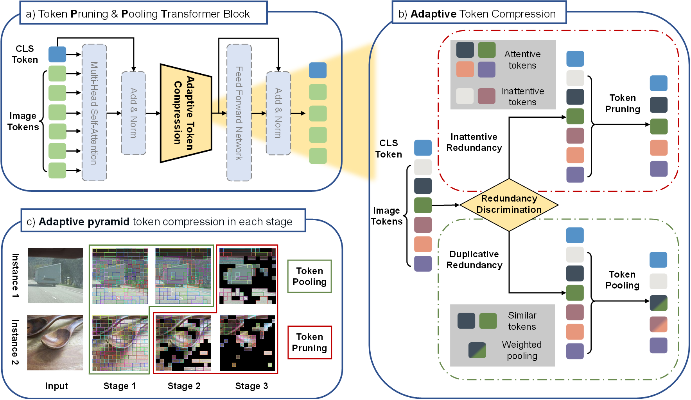
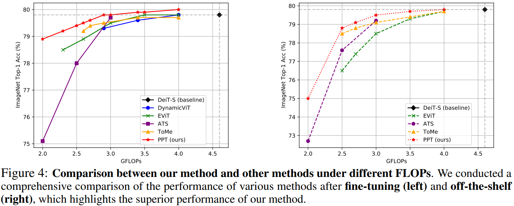

# PPT: Token Pruning and Pooling for Efficient Vision Transformers

Official PyTorch implementation of **PPT** from our paper: [PPT: Token Pruning and Pooling for Efficient Vision Transformers](https://arxiv.org/abs/2310.01812).
Xinjian Wu, Fanhu Zeng, Xiudong Wang, Xinghao Chen


## What is PPT?



&nbsp;
The proposed framework, named token Pruning & Pooling Transformers (PPT), allows you to take an existing Vision Transformer architecture and efficiently compress tokens inside of the network for faster evaluation. PPT is tuned to seamlessly fit inside existing vision transformers, so you can use it without having to do additional training. And if you *do use* PPT during training, you can reduce the accuracy drop even further while also speeding up training considerably.

## What PPT does

PPT can jointly tackle the inattentive redundancy and duplicative redundancy in images via token pruning and token pooling methods. **PPT is not a simple combination of existing techniques**. As detailed in Section 3.4 of the paper, PPT is derived based on a closer look at the characteristics of token pruning and token merging techniques, as well as a thorough analysis of the importance scores in different layers. Additionally, we **heuristically design a redundancy criterion**, i.e., the variance of the significance scores, to guide **adaptive decision-making** on prioritizing different token compression policies for various layers and instances.



&nbsp;
In order to demonstrate the performance of the approach more intuitively, we show the visualization of token compression results on ImageNet-1k val using a trained DeiT-S model with PPT.


## News

+ **[2024.01.18]** Codes of PPT are released both in [PyTorch](https://github.com/xjwu1024/PPT) and [Mindspore](https://github.com/mindspore-lab/models/).

## Usage

### Requirements

```
 - python >= 3.8
 - pytorch >= 1.12.1  # For scatter_reduce
 - torchvision        # With matching version for your pytorch install
 - timm == 0.4.12     # Might work on other versions, but this is what we tested
 - scipy              # For visualization and sometimes torchvision requires it
 - torchprofile       # For calculate the FLOPs
```

Clone the repository locally:

```
git clone https://github.com/xjwu1024/PPT.git
```

### Data preparation

Download and extract ImageNet train and val images from http://image-net.org/.
The directory structure is the standard layout for the torchvision [`datasets.ImageFolder`](https://pytorch.org/docs/stable/torchvision/datasets.html#imagefolder), and the training and validation data is expected to be in the `train/` folder and `val` folder respectively:

```
/path/to/imagenet/
  train/
    class1/
      img1.jpeg
    class2/
      img2.jpeg
  val/
    class1/
      img3.jpeg
    class2/
      img4.jpeg
```

### Evaluation

To evaluate PPT on a pre-trained DeiT-small (without fine-tuning) on ImageNet val with a single GPU run:
```
python3 main.py --eval --resume https://dl.fbaipublicfiles.com/deit/deit_small_patch16_224-cd65a155.pth --model deit_small_patch16_224 --data-path //home/zzq/Documents/data/imagenet_torch --batch_size 256 --r_tokens 50 --pp_loc_list 3 6 9 --threshold 7e-5

python3 main.py --eval --resume /home/zzq/Documents/apps/transformer/vision/base_models/deit_tiny_patch16_224-a1311bcf.pth --model deit_tiny_patch16_224 --data-path //home/zzq/Documents/data/imagenet_torch --batch_size 256 --r_tokens 50 --pp_loc_list 3 6 9 --threshold 7e-5
```
This should give
```
macs:2.944411999GFLOPs
* Acc@1 79.498 Acc@5 94.722 loss 0.913
```
```
batch 1024: 1364 --> 2020
batch 512:  1380 --> 1930
batch 256:  1409 --> 2063
batch 128:  1374 --> 1985
batch 64:   1343 --> 1913
batch 32:   1306 --> 1791
batch 8:    1114 --> 1275
batch 4:    883 --> 901
batch 2:    660 --> 571
batch 1:    361 --> 330
```

| r_tokens | macs   | params  |   Acc@1  | FPS@batch=1 |
|----------|--------|---------|----------|-------------|
| 0        | 4.60   |   22.1  | 79.81%   |  339 / 397  |
| 20       | 3.92   |   22.1  | 79.80%   |  326 / 397  |
| 50       | 2.94   |   22.1  | 79.51%   |  335 / 397  |
| 80       | 2.45   |   22.1  | 78.27%   |  347 / 689  |
| 100      | 2.29   |   22.1  | 77.20%   |  343 / 689  |

To evaluate PPT on a pre-trained DeiT-tiny (without fine-tuning) on ImageNet val with a single GPU run:

```
python3 main.py --eval --resume /home/zzq/Documents/apps/transformer/vision/base_models/deit_tiny_patch16_224-a1311bcf.pth --model deit_tiny_patch16_224 --data-path //home/zzq/Documents/data/imagenet_torch --batch_size 256 --r_tokens 50 --pp_loc_list 3 6 9 --threshold 7e-5
```
This should give
```
macs:0.800801903GFLOPs
* Acc@1 71.268 Acc@5 90.512 loss 1.265
```
```
batch 1024: 3612 --> 4854
batch 512:  3605 --> 5073
batch 256:  3374 --> 4529
batch 128:  3287 --> 4575
batch 64:   3200 --> 4292
batch 32:   2972 --> 3726
batch 8:    2262 --> 2127
batch 4:    1520 --> 1256
batch 2:    1115 --> 685
batch 1:    689  --> 352
```
```
r_tokens: 50
macs:0.800801903GFLOPs
* Acc@1 71.268 Acc@5 90.512 loss 1.265
```

ATS scoring : Deit-Tiny
| r_tokens | macs   | params  |   Acc@1  | FPS@batch=1 |
|----------|--------|---------|----------|-------------|
| 0        | 1.26   |   5.7   | 72.15%   |  498 / 689  |
| 20       | 1.07   |   5.7   | 72.05%   |  348 / 689  |
| 50       | 0.80   |   5.7   | 71.27%   |  352 / 689  |
| 80       | 0.67   |   5.7   | 68.96%   |  360 / 689  |
| 100      | 0.62   |   5.7   | 66.19%   |  349 / 689  |


Simple scoring: eval 500 frames : Deit-Tiny
| method    | r_tokens | macs   | params  |   Acc@1  | FPS@batch=1 |
|-----------|----------|--------|---------|----------|-------------|
| PPT       | 50       | 0.80   |   5.7   | 71.27%   |  365 / 784  |
| Simple + ToMe | 50   | 0.80   |   5.7   | 71.24%   |  381 / 784  |
| ATS       | 50       | 0.80   |   5.7   | 68.49%   |  399 / 784  |
| ToMe      | 50       | 0.80   |   5.7   | 71.13%   |  377 / 784  |
| Simple    | 50       | 0.80   |   5.7   | 68.38%   |  424 / 784  |


Simple scoring: eval 500 frames : Deit-Base
| method    | r_tokens | macs   | params  |   Acc@1  | FPS@batch=1 |
|-----------|----------|--------|---------|----------|-------------|
| PPT       | 50       | 11.26  |   86.6  | 80.02%   |  244 / 239  |
| Simple + ToMe | 50   | 11.26  |   86.6  | 79.96%   |  249 / 239  | # thr 7e-5
| Simple + ToMe | 50   | 11.26  |   86.6  | 79.81%   |  254 / 239  | # thr 1e-5
| ATS       | 50       | 11.26  |   86.6  | 80.33%   |  259 / 239  | # thr 0e-5
| ToMe      | 50       | 11.26  |   86.6  | 79.84%   |  239 / 239  | # thr 1e5
| Simple    | 50       | 11.26  |   86.6  | 80.12%   |  264 / 239  | # thr 0e-5


Simple scoring: eval 500 frames : Deit-Tiny
| method    | r_tokens | pp_loc_list | macs   | params  |   Acc@1  | FPS@batch=1 |
|-----------|----------|----------|--------|---------|----------|-------------|
| Simple    | 0        |  369     | 1.26   |   5.7   | 72.14%   |  527 / 784  |
| Simple    | 20       |  369     | 1.06   |   5.7   | 71.72%   |  422 / 784  |
| Simple    | 50       |  369     | 0.80   |   5.7   | 68.38%   |  424 / 784  |
| Simple    | 75       |  369     | 0.68   |   5.7   | 63.53%   |  424 / 784  |
| Simple    | 100      |  369     | 0.62   |   5.7   | 60.19%   |  424 / 784  |


Ablation: eval 500 frames : Deit-Tiny
| method    | r_tokens | pp_loc_list | macs   | params  |   Acc@1  | FPS@batch=1 |
|-----------|----------|----------|--------|---------|----------|-------------|
| only score                 | 0        |  369     | 1.26   |   5.7   | 72.14%   |  527 / 784  |
| only score w/o score normal| 0        |  369     | 1.26   |   5.7   | 72.14%   |  555 / 784  |
| score + threshold          | 1/n_tokens * 0.5 |  369     | 0.93   |   5.7   | 70.93%   |  417 / 784  |
| score + threshold          | 1/n_tokens * 0.65|  369     | 0.80   |   5.7   | 68.62%   |  418 / 784  |
| score + threshold          | 1/n_tokens * 0.8 |  369     | 0.69   |   5.7   |          |  417 / 784  |
| score + threshold          | 1/n_tokens       |  369     | 0.52   |   5.7   | 50.91%   |  415 / 784  |
| score + threshold          | 1/n_tokens * 1.5 |  369     | 0.43   |   5.7   |          |  508 / 784  |
| score + threshold          | 1/n_tokens * 2.0 |  369     | 0.39   |   5.7   |          |  500 / 784  |
| score + threshold w/o score normal  | 1/n_tokens * 0.65 |  369     | 0.66   |   5.7   | 68.62%   |  430 / 784  |
| Simple                     | 50               |  369     | 0.80   |   5.7   | 68.38%   |  424 / 784  |
| Simple w/o score normal    | 50               |  369     | 0.66   |   5.7   | 71.92%   |  437 / 784  |


ToMe: eval 500 frames : Deit-Tiny
| method    | r_tokens | macs   | params  |   Acc@1  | FPS@batch=1 |
|-----------|----------|--------|---------|----------|-------------|
| ToMe      | 0        | 1.26   |   5.7   | 72.15%   |  498 / 784  |
| ToMe      | 25       | 1.02   |   5.7   | 72.05%   |  377 / 784  |
| ToMe      | 50       | 0.80   |   5.7   | 71.13%   |  377 / 784  |
| ToMe      | 75       | 0.69   |   5.7   | 68.97%   |  377 / 784  |
| ToMe      | 100      | 0.62   |   5.7   | 65.31%   |  377 / 784  |


Simple scoring: eval 500 frames : Deit-Small
| method    | r_tokens | pp_loc_list | macs   | params  |   Acc@1  | FPS@batch=1 |
|-----------|----------|----------|--------|---------|----------|-------------|
| Simple    | 0        |  369     | 4.60   |   22.1  | 79.81%   |  382 / 452  |
| Simple    | 20       |  369     | 3.92   |   22.1  | 79.72%   |  374 / 452  |
| Simple    | 50       |  369     | 2.94   |   22.1  | 78.31%   |  379 / 452  |
| Simple    | 75       |  369     | 2.51   |   22.1  | 75.76%   |  377 / 452  |
| Simple    | 100      |  369     | 2.28   |   22.1  | 73.84%   |  389 / 452  |


Simple scoring: eval 500 frames : Deit-Base
| method    | r_tokens | pp_loc_list | macs   | params  |   Acc@1  | FPS@batch=1 |
|-----------|----------|----------|--------|---------|----------|-------------|
| Simple    | 0        |  369     | 17.57  |   86.6  | 81.80%   |  218 / 239  |
| Simple    | 20       |  369     | 15.00  |   86.6  | 81.75%   |  229 / 239  |
| Simple    | 30       |  369     | 13.73  |   86.6  | 81.46%   |  235 / 239  |
| Simple    | 40       |  369     | 12.45  |   86.6  | 81.14%   |  254 / 239  |
| Simple    | 50       |  369     | 11.26  |   86.6  | 80.12%   |  264 / 239  |
| Simple    | 75       |  369     | 9.61   |   86.6  | 77.42%   |  284 / 239  |
| Simple    | 100      |  369     | 8.72   |   86.6  | 74.60%   |  291 / 239  |


To evaluate PPT on a pre-trained DeiT-base (without fine-tuning) on ImageNet val with a single GPU run:

```
python3 main.py --eval --resume /home/zzq/Documents/apps/transformer/vision/base_models/deit_base_patch16_224-b5f2ef4d.pth --model deit_base_patch16_224 --data-path //home/zzq/Documents/data/imagenet_torch --batch_size 256 --r_tokens 50 --pp_loc_list 3 6 9 --threshold 7e-5
```


**Noticed:** Throughput will also be evaluated, although this metric is significantly impacted by hardware. You can compare the performance of PPT with the original models to assess their effectiveness.

### Training

To fine-tuning DeiT-small on ImageNet on a single node with 4 gpus for 30 epochs run:

```
python -m torch.distributed.launch  --nproc_per_node=4 --use_env main.py --resume https://dl.fbaipublicfiles.com/deit/deit_small_patch16_224-cd65a155.pth --model deit_small_patch16_224 --batch_size 256 --data-path /path/to/imagenet --epochs 30 --output_dir outputs/PPT_DeiT-S_thr-6e-5_r-50_lr-1e-5 --lr 1e-5 --r_tokens 50 --threshold 6e-5 --pp_loc_list 3 6 9
```

## Citation

If you use PPT or this repository in your work, please cite:

```
@article{wu2023ppt,
  title={Ppt: Token pruning and pooling for efficient vision transformers},
  author={Wu, Xinjian and Zeng, Fanhu and Wang, Xiudong and Chen, Xinghao},
  journal={arXiv preprint arXiv:2310.01812},
  year={2023}
}
```

and provide a link to this repository as a footnote or a citation.
